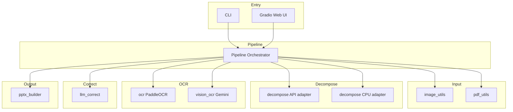
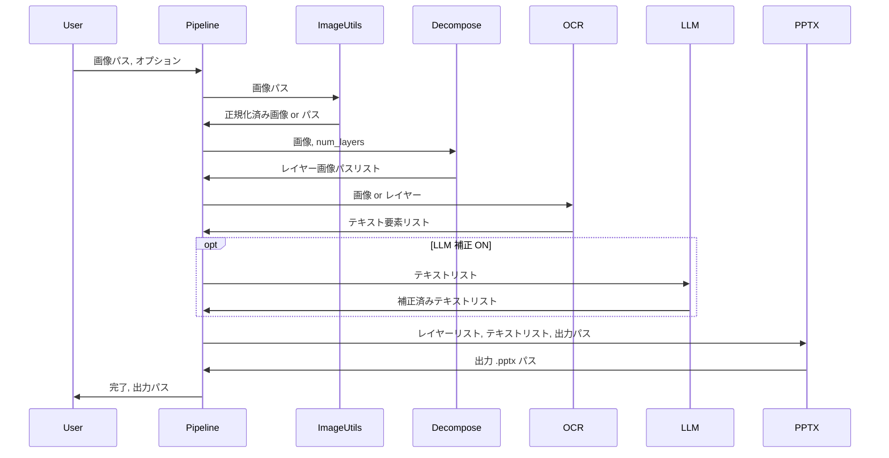

# 技術設計書: Kirigami 型 画像→PPTX 変換ツール

---
**Purpose**: 実装の一貫性を保ち解釈のぶれを防ぐため、アーキテクチャ・境界・インターフェースを定義する。
---

## Overview

本機能は、AI 生成スライド画像（または一般画像）を編集可能な PowerPoint（.pptx）に変換するローカルツールを提供する。利用者は CLI または Gradio Web UI から画像/PDF を投入し、レイヤー分解・OCR・オプションで LLM 補正を経て .pptx を取得する。対象ユーザーは個人（開発者本人）であり、認証・課金・リモートデプロイは不要とする。

**Impact**: 現状は未実装のため、新規パイプラインおよび CLI/Web UI の追加により、指定環境（Ubuntu、Python 3.10–3.12、NVIDIA GPU 非前提）で画像→PPTX の一気通貫を実現する。

### Goals

- 画像/PDF を入力とし、編集可能な .pptx を出力するパイプラインを実装する。
- レイヤー分解は fal.ai API をデフォルトとし、オフライン時は CPU 推論で代替可能とする。
- テキスト抽出は PaddleOCR を主とし、オプションで LLM 補正・Gemini Vision 一括ルートを提供する。
- CLI と Gradio Web UI の両方で同一パイプラインを利用可能とする。

### Non-Goals

- リモートサーバーへのデプロイ・マルチテナント・認証は対象外とする。
- NVIDIA GPU（CUDA）前提の最適化は行わない。
- リアルタイムプレビューや協調編集は対象外とする。

---

## Architecture

### Architecture Pattern & Boundary Map

採用パターン: **パイプライン＋アダプタ**。処理を「入力・前処理 → レイヤー分解 → テキスト抽出 → テキスト補正（オプション）→ PPTX 生成」のステップに分割し、レイヤー分解と OCR は複数実装（API/CPU、PaddleOCR/Gemini Vision）をアダプタで切替える。詳細な選定理由は `research.md` を参照。



- **Domain boundaries**: 入力（画像/PDF）→ 前処理 → 分解 → テキスト → 補正 → 出力。各ステップは「入力型 → 出力型」の契約で隠蔽する。
- **Steering compliance**: ローカル単体・認証不要・Python 単一言語という前提を維持する。

### Technology Stack

| Layer | Choice / Version | Role in Feature | Notes |
|-------|------------------|-----------------|-------|
| CLI | argparse / click | 引数解析・パイプライン起動 | 1.3, 6.1 |
| Web UI | Gradio 4.x | ファイルアップロード・進捗・ダウンロード | 6.2, 6.3 |
| Backend / Pipeline | Python 3.10–3.12 | オーケストレーション・各モジュール呼び出し | 8.2 |
| 画像前処理 | Pillow, OpenCV | 読み込み・リサイズ・正規化 | 1.6 |
| PDF | PyMuPDF (fitz) | PDF→ページ画像 | 1.2 |
| レイヤー分解 | fal-client / diffusers+torch(CPU) | API またはローカル推論 | 2.1–2.6 |
| OCR | PaddleOCR, google-generativeai | テキスト＋座標、または Vision 一括 | 3.1–3.5 |
| LLM 補正 | anthropic, google-generativeai, ollama | 誤認識補正 | 4.1–4.4 |
| 出力 | python-pptx | .pptx 生成 | 5.1–5.6 |
| 設定 | PyYAML, python-dotenv | config.yaml と .env | 7.1–7.4 |

---

## System Flows

### メインパイプライン（画像 1 枚）



- **分岐**: config/CLI の decompose backend で API または CPU を選択。ocr method で PaddleOCR または Gemini Vision を選択。llm_correct が無効の場合は LLM ステップをスキップする。

### PDF およびバッチ

- PDF 入力時: pdf_utils がページごとに画像を生成し、各ページをメインパイプラインに渡す。出力は 1 ファイル 1 スライドまたは 1 pptx に複数スライドをまとめるかを設計で規定する（本設計では 1 入力 1 .pptx を基本とする）。
- バッチ: CLI/UI が複数入力に対してループでパイプラインを呼び出す。並列化は将来拡張とする。

---

## Requirements Traceability

| Req | Summary | Components | Interfaces | Flows |
|-----|---------|------------|-------------|-------|
| 1.1 | 画像ファイル入力受付 | pipeline, image_utils | load_image | Main flow |
| 1.2 | PDF ページ分割 | pipeline, pdf_utils | pdf_to_images | Batch |
| 1.3 | CLI ファイル/ディレクトリ指定 | cli | — | — |
| 1.4 | Web UI ドラッグ&ドロップ | app | — | — |
| 1.5 | バッチ一括変換 | pipeline, cli | run_batch | Batch |
| 1.6 | 前処理（リサイズ・正規化） | image_utils | normalize_image | Main flow |
| 2.1–2.4 | レイヤー分解・層数指定 | decompose | decompose_image | Main flow |
| 2.5–2.6 | API/CPU 切替・CUDA 非依存 | decompose, config | DecomposeAdapter | Main flow |
| 3.1–3.5 | テキスト抽出・座標・属性・Vision 代替 | ocr, vision_ocr | extract_text | Main flow |
| 4.1–4.4 | LLM 補正・複数プロバイダ・座標維持 | llm_correct | correct_texts | Main flow |
| 5.1–5.6 | PPTX 出力・Z-order・出力先・アスペクト比 | pptx_builder | build_pptx | Main flow |
| 6.1–6.4 | CLI オプション・Web UI 機能・ローカル起動 | cli, app | — | — |
| 7.1–7.4 | config.yaml・.env・フォールバック・一時ファイル | config_loader, pipeline | load_config | — |
| 8.1–8.5 | CUDA 非前提・Python 版・オフライン・エラー・進捗 | 全コンポーネント | — | Error handling |

---

## Components and Interfaces

### コンポーネント概要

| Component | Domain/Layer | Intent | Req Coverage | Key Dependencies | Contracts |
|-----------|--------------|--------|--------------|------------------|------------|
| pipeline | Core | ステップ順実行・ルーティング | 1.x–5.x, 7.x | image_utils, pdf_utils, decompose, ocr, vision_ocr, llm_correct, pptx_builder, config | Service |
| image_utils | Input | 画像読込・前処理 | 1.1, 1.6 | Pillow, OpenCV | Service |
| pdf_utils | Input | PDF→画像 | 1.2 | PyMuPDF | Service |
| decompose | Decompose | レイヤー分解（API/CPU 切替） | 2.x | fal-client or diffusers, config | Service |
| ocr | OCR | PaddleOCR テキスト＋座標 | 3.1–3.4 | PaddleOCR | Service |
| vision_ocr | OCR | Gemini Vision 一括 | 3.5 | google-generativeai | Service |
| llm_correct | Correct | LLM 補正・フォールバック | 4.x | anthropic, google-generativeai, ollama | Service |
| pptx_builder | Output | PPTX 生成 | 5.x | python-pptx | Service |
| config_loader | Config | 設定・環境変数読込 | 7.x | PyYAML, dotenv | Service |
| cli | Entry | CLI 引数・パイプライン起動 | 1.3, 6.1 | pipeline, config_loader | — |
| app | Entry | Gradio UI・進捗・ダウンロード | 6.2–6.4 | pipeline, config_loader, gr | — |

### Input Layer

#### image_utils

| Field | Detail |
|-------|--------|
| Intent | 画像ファイルの読み込み・リサイズ・正規化を行い、後段が扱いやすい形式で返す |
| Requirements | 1.1, 1.6 |

**Responsibilities & Constraints**
- 対応形式: PNG, JPEG, WebP。RGBA または RGB に正規化。
- 解像度は config の resolution に合わせる（レイヤー分解の入力制約に合わせる）。

**Dependencies**
- Inbound: なし（エントリからパスを受け取る）
- Outbound: なし（戻り値は画像オブジェクトまたは一時保存パス）
- External: Pillow, OpenCV — 画像読込・変換 (P0)

**Contracts**: Service [x]

##### Service Interface（Python 型ヒント）

```python
# 疑似: 実装はコードにしないが契約として記載
def load_image(path: str) -> Image.Image: ...
def normalize_image(image: Image.Image, max_size: int = 640) -> Image.Image: ...
```

- Preconditions: path が存在し対応形式であること。
- Postconditions: 返却画像は後段（decompose / ocr）が受け付け可能な形式であること。

#### pdf_utils

| Field | Detail |
|-------|--------|
| Intent | PDF をページ単位の画像に変換する |
| Requirements | 1.2 |

**Dependencies**
- External: PyMuPDF — ページレンダリング (P0)

**Contracts**: Service [x]

##### Service Interface

```python
def pdf_to_images(pdf_path: str, dpi: int = 150, temp_dir: str | None = None) -> list[str]: ...
# 戻り値: 各ページの画像ファイルパスのリスト
```

---

### Decompose Layer

#### decompose（レイヤー分解オーケストラ＋API/CPU アダプタ）

| Field | Detail |
|-------|--------|
| Intent | 画像を複数 RGBA レイヤーに分解し、レイヤー画像パスリストを返す |
| Requirements | 2.1–2.6 |

**Responsibilities & Constraints**
- backend が "api" のときは fal.ai を呼び出し、返却 URL から画像をダウンロードして temp に保存。
- backend が "cpu" のときはローカルパイプライン（diffusers）を実行。CUDA は使用しない。
- レイヤー数は呼び出し元（config/CLI）から指定される。

**Dependencies**
- Inbound: pipeline — 画像パス・num_layers (P0)
- External: fal-client（API）、diffusers/transformers/torch（CPU）(P0)

**Contracts**: Service [x]

##### Service Interface

```python
def decompose_image(
    image_path: str,
    num_layers: int = 4,
    backend: Literal["api", "cpu"] = "api",
    output_dir: str | None = None,
) -> list[str]: ...
# 戻り値: レイヤー画像のファイルパスリスト（Z-order 順）
```

- Preconditions: image_path が存在し、画像が読み込み可能であること。backend に応じた API キーまたはモデルが利用可能であること。
- Postconditions: 返却リストの長さは num_layers 以下。各要素は存在する PNG 等のパス。

---

### OCR Layer

#### ocr（PaddleOCR）

| Field | Detail |
|-------|--------|
| Intent | 画像からテキスト・bbox・信頼度を抽出する |
| Requirements | 3.1–3.4 |

**Dependencies**
- External: PaddleOCR (P0)

**Contracts**: Service [x]

##### Service Interface

```python
# テキスト要素の共通型（Data Model と整合）
class TextElement(TypedDict):
    text: str
    bbox: tuple[float, float, float, float]  # 正規化座標 0-1 または pixel
    confidence: float
    font_size_pt: float | None
    font_color: str | None  # #RRGGBB
    is_bold: bool | None

def extract_text(image_path: str, lang: str = "japan") -> list[TextElement]: ...
```

#### vision_ocr（Gemini Vision）

| Field | Detail |
|-------|--------|
| Intent | 画像を Vision API に渡し、テキスト＋座標＋属性を一括取得する |
| Requirements | 3.5 |

**Contracts**: Service [x]

##### Service Interface

```python
def extract_text_with_vision(image_path: str) -> list[TextElement]: ...
```

---

### Correct Layer

#### llm_correct

| Field | Detail |
|-------|--------|
| Intent | OCR 結果のテキストを文脈ベースで補正する。座標は維持する |
| Requirements | 4.1–4.4 |

**Dependencies**
- External: anthropic, google-generativeai, ollama (P1。フォールバック順で利用)

**Contracts**: Service [x]

##### Service Interface

```python
def correct_texts(
    elements: list[TextElement],
    provider: Literal["anthropic", "google", "ollama"] = "anthropic",
) -> list[TextElement]: ...
# 各要素の text を補正し、bbox 等は変更しない
```

---

### Output Layer

#### pptx_builder

| Field | Detail |
|-------|--------|
| Intent | レイヤー画像とテキスト要素から .pptx を生成する |
| Requirements | 5.1–5.6 |

**Dependencies**
- External: python-pptx (P0)

**Contracts**: Service [x]

##### Service Interface

```python
def build_pptx(
    layer_paths: list[str],
    text_elements: list[TextElement],
    output_path: str,
    slide_width_inches: float = 13.333,
    slide_height_inches: float = 7.5,
) -> str: ...
# 戻り値: output_path
# レイヤーは Z-order 順に add_picture、テキストは add_textbox で最前面に配置
```

---

### Config

#### config_loader

| Field | Detail |
|-------|--------|
| Intent | config.yaml と .env を読み込み、パイプライン・各コンポーネントに渡す設定オブジェクトを提供する |
| Requirements | 7.1–7.4 |

**Contracts**: Service [x]

##### Service Interface

```python
# 設定は dataclass または TypedDict で型付け。API キーは env のみ。
def load_config(config_path: str = "config.yaml") -> AppConfig: ...
# AppConfig は decompose.backend, ocr.method, llm_correction.enabled 等を保持
```

---

## Data Models

### Domain Model

- **入力**: 単一画像パス、または PDF パス、またはディレクトリパス（バッチ）。オプションとして num_layers, backend, ocr_method, llm_correct, output_dir。
- **中間**: 正規化画像、レイヤー画像パスリスト、テキスト要素リスト（TextElement のリスト）。補正後も TextElement のリストで、bbox は不変。
- **出力**: 生成された .pptx のファイルパス。

### Data Contracts

- **TextElement**: 上記の通り。全 OCR/補正/PPTX 間で共通。
- **レイヤーリスト**: 先頭を背景、以降を前面に向かう Z-order とする。pptx_builder はこの順で add_picture する。
- **座標**: 画像幅・高さに対する 0–1 正規化、またはピクセル。pptx_builder がスライド寸法（インチ/Emu）に変換する。

---

## Error Handling

### Error Strategy

- **入力エラー**: 対応形式でない・ファイル不存在 → 明確なメッセージで即失敗（4xx 相当）。バッチの場合は当該ファイルをスキップし続行可能とする（8.4）。
- **API エラー**: fal.ai / Claude / Gemini の障害・レート制限 → リトライは設定で回数制限し、超過時は「API 利用不可」とし、代替（CPU 分解・補正 OFF）を案内する。
- **一時ファイル**: 処理後は config の clean_temp に従い削除。削除失敗はログのみで処理は成功とする。

### Monitoring

- 進捗: CLI はログまたは tqdm、Web UI は gr.Progress でステップ表示（8.5）。
- エラー: 例外をキャッチし、ユーザー向けメッセージと必要に応じてスタックをログに出力する。

---

## Testing Strategy

- **Unit**: image_utils の正規化、pdf_utils のページ数・解像度、pptx_builder の座標変換・Z-order。モックで外部 API を排除。
- **Integration**: テスト用画像 1 枚で pipeline を end-to-end（decompose はモックまたは小さい画像＋API キーありの場合のみ）。OCR → llm_correct → pptx_builder のデータ型の受け渡し検証。
- **E2E/UI**: Gradio のファイルアップロード → 処理 → ダウンロードリンクが得られることを手動または簡単な自動で確認。
- **Performance**: 1 枚あたりの処理時間（API モードで 30 秒以内等）を目標に、計測ポイントを pipeline に仕込む。

---

## Supporting References

- 外部 API の詳細スキーマ・料金・制限: `research.md` を参照。
- 実装時の fal.ai 入力/出力 JSON、PaddleOCR 戻り値の bbox 形式は、各アダプタの実装と単体テストで固定する。
